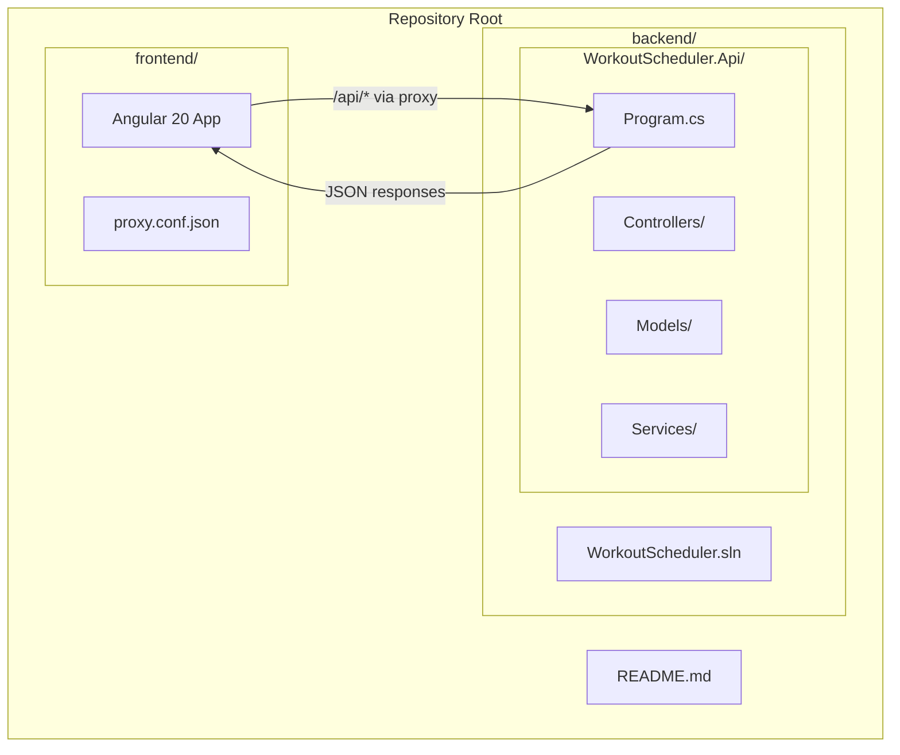

# Design Document: Workout Scheduling Full-Stack Project

## Overview

This design describes the scaffolding of a full-stack web application for scheduling workouts, consisting of a .NET 10 ASP.NET Core Web API backend and an Angular 20 frontend. The project prioritizes clean separation of concerns, a smooth local development experience with proxy-based API forwarding, and a working end-to-end integration example out of the box.

The repository will be organized as a monorepo with two top-level directories: `backend/` for the .NET solution and `frontend/` for the Angular application. A root-level README provides unified build and run instructions.

## Architecture



### Key Architectural Decisions

1. **Monorepo layout**: Both backend and frontend live in the same repository under `backend/` and `frontend/` folders. This keeps the project self-contained and simplifies onboarding.

2. **Proxy-based development**: The Angular dev server proxies `/api` requests to the .NET backend, eliminating CORS issues during local development. CORS is still configured on the backend as a fallback for non-proxied scenarios.

3. **Minimal API hosting with controllers**: The .NET project uses the modern minimal hosting model in `Program.cs` but organizes endpoints in controller classes for maintainability as the project grows.

4. **Standalone Angular components**: Angular 20 defaults to standalone components (no NgModules), which is the modern recommended approach.

## Components and Interfaces

### Backend Components

#### Program.cs (Entry Point)
- Configures services: controllers, CORS, JSON serialization (camelCase)
- Maps controller routes under `/api` prefix
- Registers a health-check endpoint at `GET /api/health`

#### HealthCheckController
- `GET /api/health` → Returns `{ "status": "healthy", "timestamp": "<ISO8601>" }`
- HTTP 200 response with `application/json` content type

#### WeatherForecastController (Sample)
- `GET /api/weatherforecast` → Returns an array of forecast objects
- Demonstrates the Controllers/Models/Services folder structure

#### WeatherForecastService
- Generates sample weather forecast data
- Injected into the controller via dependency injection
- Demonstrates the service layer pattern

#### WeatherForecast (Model)
- Properties: `Date` (DateOnly), `TemperatureC` (int), `Summary` (string)
- Computed property: `TemperatureF`
- Serialized with camelCase JSON naming

### Frontend Components

#### AppComponent
- Root component that displays the API health status
- Calls `HealthService` on initialization and renders the response or an error message

#### HealthService
- Angular injectable service using `HttpClient`
- `checkHealth(): Observable<HealthResponse>` → calls `GET /api/health`
- Returns typed response or propagates errors

#### Proxy Configuration (proxy.conf.json)
- Routes `/api` requests to `http://localhost:5000` (or configured backend port)
- `secure: false` for local development
- `changeOrigin: true`

### Interface Contracts

```
GET /api/health
Response 200:
{
  "status": "healthy",
  "timestamp": "2025-01-15T10:30:00Z"
}

GET /api/weatherforecast
Response 200:
[
  {
    "date": "2025-01-16",
    "temperatureC": 22,
    "temperatureF": 71,
    "summary": "Warm"
  }
]
```

## Data Models

### Backend Models

```csharp
// Models/WeatherForecast.cs
public class WeatherForecast
{
    public DateOnly Date { get; set; }
    public int TemperatureC { get; set; }
    public string? Summary { get; set; }
    public int TemperatureF => 32 + (int)(TemperatureC / 0.5556);
}

// Models/HealthResponse.cs
public class HealthResponse
{
    public string Status { get; set; } = "healthy";
    public DateTime Timestamp { get; set; } = DateTime.UtcNow;
}
```

### Frontend Models

```typescript
// models/health-response.ts
export interface HealthResponse {
  status: string;
  timestamp: string;
}

// models/weather-forecast.ts
export interface WeatherForecast {
  date: string;
  temperatureC: number;
  temperatureF: number;
  summary: string;
}
```

### JSON Serialization

The backend configures `System.Text.Json` with `JsonSerializerOptions.PropertyNamingPolicy = JsonNamingPolicy.CamelCase` so all responses use camelCase property names, matching TypeScript/JavaScript conventions on the frontend.


## Correctness Properties

*A property is a characteristic or behavior that should hold true across all valid executions of a system — essentially, a formal statement about what the system should do. Properties serve as the bridge between human-readable specifications and machine-verifiable correctness guarantees.*

Most acceptance criteria for this project are structural scaffolding checks (file existence, folder structure, configuration values) that are best verified as specific examples rather than universally quantified properties. One property emerges from the serialization requirement.

### Property 1: CamelCase JSON serialization round trip

*For any* C# model object with PascalCase property names, serializing it through the API's configured `System.Text.Json` options and then inspecting the resulting JSON keys should yield camelCase equivalents of every public property name.

**Validates: Requirements 4.3**

## Error Handling

### Backend Error Handling

- **Unhandled exceptions**: ASP.NET Core's built-in exception handling middleware returns a generic 500 response in production. In development, the developer exception page provides detailed error info.
- **Health endpoint**: Always returns 200 with a JSON body. If the server is running, the endpoint is reachable.
- **Invalid routes**: Return 404 via default ASP.NET Core routing behavior.
- **CORS violations**: Requests from non-allowed origins receive no CORS headers, and the browser blocks the response. The backend logs a warning.

### Frontend Error Handling

- **API unreachable**: The `HealthService` catches HTTP errors. The `AppComponent` displays a user-friendly error message (e.g., "Unable to connect to the API server") instead of failing silently. This satisfies Requirement 5.3.
- **HTTP error responses**: Non-2xx responses from the API are caught by the service's error handler and surfaced to the component.
- **Proxy failures**: When the Angular dev server proxy cannot reach the backend, it returns a 504 Gateway Timeout. The frontend error handler treats this the same as any HTTP error.

## Testing Strategy

### Unit Tests

Unit tests verify specific examples and edge cases. For this scaffolding project, they focus on:

- **Health endpoint**: Verify `GET /api/health` returns 200 with `{ status: "healthy", timestamp: "..." }`.
- **WeatherForecast endpoint**: Verify `GET /api/weatherforecast` returns a JSON array of forecast objects with expected properties.
- **CORS configuration**: Verify the backend allows the Angular dev server origin.
- **Angular HealthService**: Verify it calls the correct URL and handles errors gracefully.
- **Angular AppComponent**: Verify it renders health status on success and an error message on failure.
- **Proxy config**: Verify `proxy.conf.json` contains the correct `/api` target.

### Property-Based Tests

Property-based tests verify universal properties across generated inputs. The project uses **FsCheck** (for .NET) as the property-based testing library.

Each property test runs a minimum of 100 iterations.

- **Property 1 test**: Generate random C# model instances with various property names and values. Serialize using the API's configured `JsonSerializerOptions`. Assert that every JSON key is the camelCase version of the corresponding C# property name.
  - Tag: **Feature: dotnet-angular-project, Property 1: CamelCase JSON serialization round trip**

### Test Organization

- Backend tests: `backend/WorkoutScheduler.Api.Tests/` project using xUnit + FsCheck.
- Frontend tests: Angular CLI default test setup with Karma/Jasmine (or Jest if configured). Property tests use **fast-check** for TypeScript.
- Each property-based test references its design document property via a comment tag.
